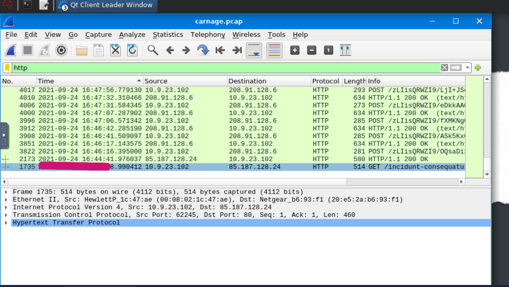
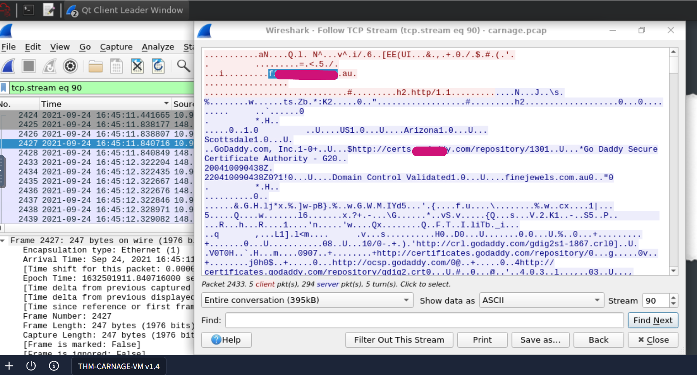
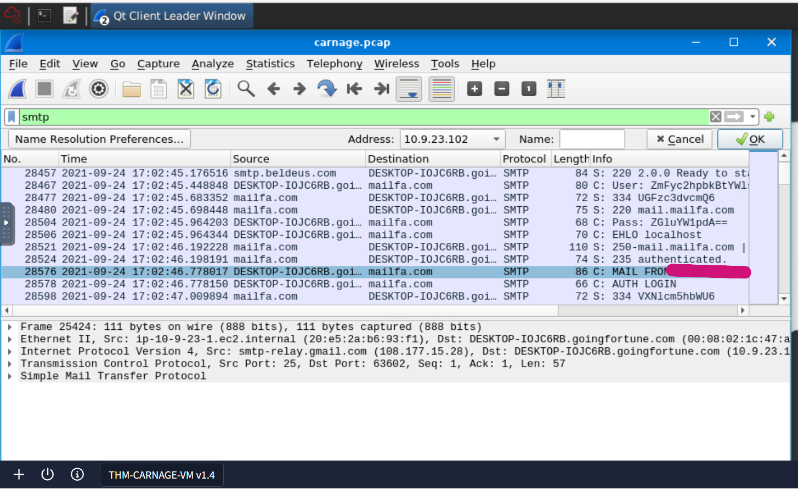

# 🛡️ Lab Report: Carnage
## Difficulty: Medium
**Category:** Blue Team / Network Traffic Analysis  
**Tools:** Wireshark, VirusTotal  

---

## Lab Overview
> Eric Fischer from the Purchasing Department at Bartell Ltd has received an email from a known contact with a Word document attachment.  Upon opening the document, he accidentally clicked on "Enable Content."  The SOC Department immediately received an alert from the endpoint agent that Eric's workstation was making suspicious connections outbound. The pcap was retrieved from the network sensor and handed to you for analysis. 

> `Task:` Investigate the packet capture and uncover the malicious activities. 

---
## PCAP overview
* PCAP = packet capture of network traffic
* Wireshark reads .pcap files
* Files such as .xls can be extracted from captured traffic

---

## 🔍 Task 1: Initial Analysis & Overview
I started by launching Wireshark and opening the `carnage.pcap` file. 

### Web Server Basics
I noted that a web server typically:
1. Stores website files (HTML, JS, CSS, images).
2. Listens for requests (HTTP/HTTPS).
3. Sends web pages to users' browsers.
*Common examples include Apache, Nginx, IIS, and LiteSpeed*.

### First Malicious Connection
**Question:** What was the date and time for the first HTTP connection to a malicious IP?  
* **Action:** Apply the `http` filter and look for the oldest packet.  
* **Format:** `yyyy-mm-dd hh:mm:ss` (UTC).  
* **Answer:** `2021-09-24 16:44:38`

---

##  Task 2: Malicious File Extraction
I investigated a suspicious `.zip` file download.

**Question:** Name of the zip file downloaded? 
Obtained the answer by checking the `Length Info` 
* **Answer:** `documents.zip`

**Question:** Domain hosting the malicious zip file?  
* **Action:** I expanded the `Hyper Text Transfer Protocol` that was at the bottom of the file and found the domain.
* **Answer:** `attirenepal.com`

**Question:** Name of the malicious file inside the zip (found without downloading)?  
* **Action:** Right-click the packet, select **Follow** -> **HTTP Stream**.  
* **Answer:** `chart-1530076591.xls`

**Question:** Web server version of the malicious IP?  
* **Answer:** `LiteSpeed 7.2.34`

---

##  Task 3: Encrypted Traffic (HTTPS) Analysis
Since the traffic used port 443, the payloads were encrypted.

**Question:** What three domains were involved in downloading malicious files to the victim host?  
* **Action:** Apply filter `tcp.port == 443` and look for **Client Hello** messages to see the **Server Name Indication (SNI)**. Client Hello shows when the first connection happened.
* **Domains:** 1. `finejewels.com`  
    2. `thietbiagt.com`  
    3. `new.americold.com`
_One of the Client Hello packets has a microsoft domain which is definitely not malicious_

**Question:** Which certificate authority issued the SSL certificate for the first domain?  
* **Answer:** `GoDaddy`

---

##  Task 4: Cobalt Strike & C2 Activity
I used **Statistics -> Conversations -> TCP -> Port B** to find the Command & Control (C2) servers.
I checked from *port 443,80*

**Question:** What are the 2 IP addresses of the Cobalt Strike servers?  
* **Action:** Confirm reputations on VirusTotal.  
* **IPs:** `185.106.96.158` and `185.125.204.174`

**Question:** What is the host header for the first cobalt strike server IP address from the previous question.
* **Action:** filter `ip.addr == 185.106.96.158` -> follow TCP stream

**Question:** What is the domain name (via Name Resolution) for the first Cobalt Strike server?  
* **Action:** **View** -> **Name Resolution** -> **Resolve Network Addresses**.  
* **Answer:** `survmeter.live`

**Question:** What is the domain name of the second striker server IP.
* **Action:** `filter ip.addr == 185.125.204.174` and follow steps from the previous question.
* **Answer:** `securitybusinpuff.com`

---

## Task 5: Post-Infection & Malspam
**Question:** Domain name of the post-infection traffic? 
After a computer is infected, it sends information to the server that hacked it.C2 server in this particular case.
* **Action:** **http filter** -> **Post request** 
* **Answer:** `maldivehost.net`

**Question:** First 11 characters sent to the C2 server in the POST request? 
* **Action:** **Length Info** 
* **Answer:** `zL1isQRWZl9`

**Question:** Length of the first packet sent out to the C2 server
* **Action:** **Check the first very first packet with _POST_ message**
* **Answer:** `281`

**Question:** Server header for the malicious domain from previous question.
* **Action:** **Click on packet** -> **follow TCP stream** -> **Analyze result**
* **Answer:** `Apache/2.4.49 (cPanel) OpenSSL/1.1.1l mod_bwlimited/1.4`

**Question** What was the date and time when DNS query for the IP check domain from API occurred?
* **Action:** **Filter DNS** -> **Filter DNS contains API
* **Answer:** `2021-09-24 17:00:04`

**Question:** What was the domain in the DNS query from previous question?
* **Answer:** `api.apify.org`

**Question:** What was the first "mail from" address found in the malspam traffic?  
* **Action:** Use filter `smtp contains "MAIL FROM"`.  
* **Answer:** `farshin@mailfa.com`

**Question** How many packets were observed for the SMTP traffic?
* **Action:** use filter `SMTP` -> `statistics` -> `Hierarchy Protocol` -> `SMTP`
* **Answer:** `1439`

---

## Key Takeaways
* Learned to use Hiererachy Protocol to count packets from different protocols.
* Learned to use the **SNI** field to identify encrypted HTTPS destinations.
* CLIENT HELLO shows initial connection.
* Practiced following **HTTP/TCP streams** to extract file names and server headers.
* Verified malicious IPs using **VirusTotal**