# Incident Investigation: Conti Ransomware Walkthrough
## Difficulty: Medium
**Category:** Blue Team
**Tools:** Splunk, VirusTotal
---

## Lab Overview
> Some employees from your company reported that they can’t log into Outlook. The Exchange system admin also reported that he can’t log in to the Exchange Admin Center. After initial triage, they discovered some weird readme files settled on the Exchange server.  You are assigned to investigate this situation. Use Splunk to answer the questions below regarding the Conti ransomware. 

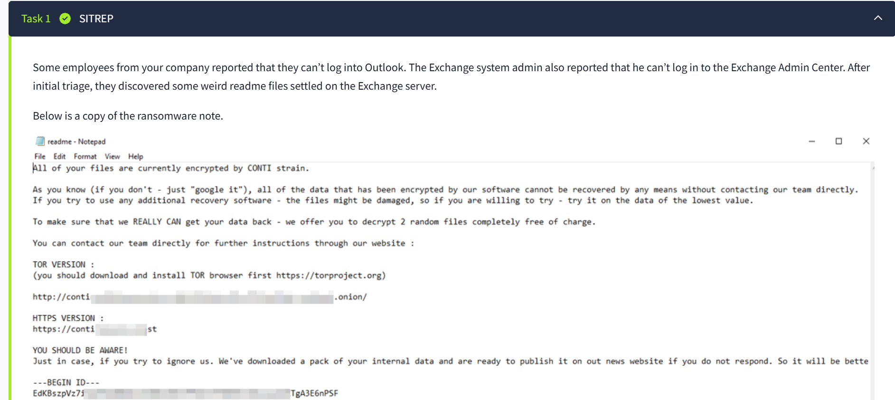

**Objective:** Investigate Conti ransomware lifecycle using Splunk.
* **Key Focus:** Initial Access -> Execution -> Persistence -> Backdoor -> Impact

---

## Task 1: Initial data retrieval
**Action:** Apply `index=* sourcetype="WinEventlog:Microsoft.windows.sysmon/operational"`
**Result:** `2664 events`
Sysmon is used as it is very useful in security checks.

**Action:** `index=* sourcetype="WinEventlog:Microsoft-Windows-Sysmon/Operational" exe`

**Result:** `2376`
We use the `exe` to find the ransomware executables.

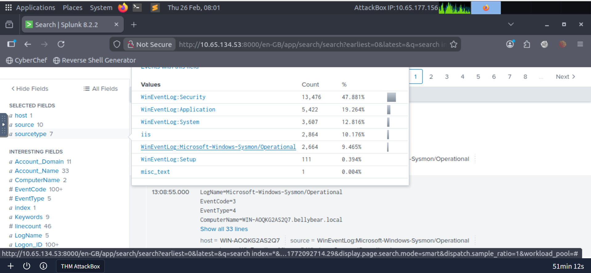

---

## Task 2: Ransomware extraction
**Question:** Find the ransomware location
**Action:** Apply filter `index=* sourcetype="WinEventlog:Microsoft-Windows-Sysmon/Operational" exe | table dedup CurrentDirectory | table CurrentDirectory Commandline Images Hashes ParentCommandline ParentImage`

These are the ideal judgement factors to find the ransomware's directory. *The `dedup` filter is used to remove duplicate results from the search results.*

**Answer:** `C:\Users\Administrator\Documents\cmd.exe`
The `cmd.exe` commandline shows that the attacker is in, 
* *MITRE:* `T1059-Execution`
[Check summary](#mitre-mapping)

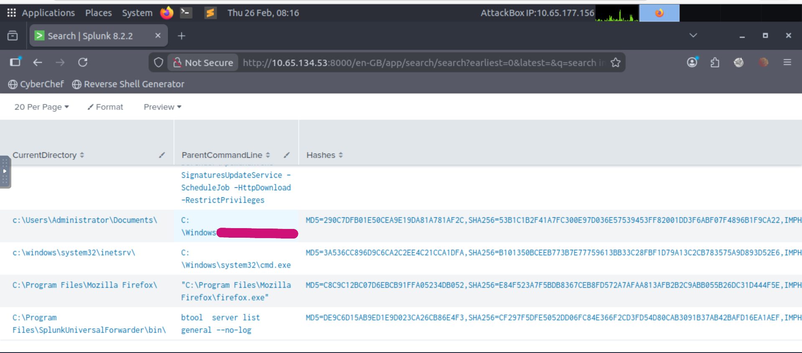

**Question:** What is the sysmon Event ID for the file creation
**Action:** `External research like google`
**Answer:** `11`
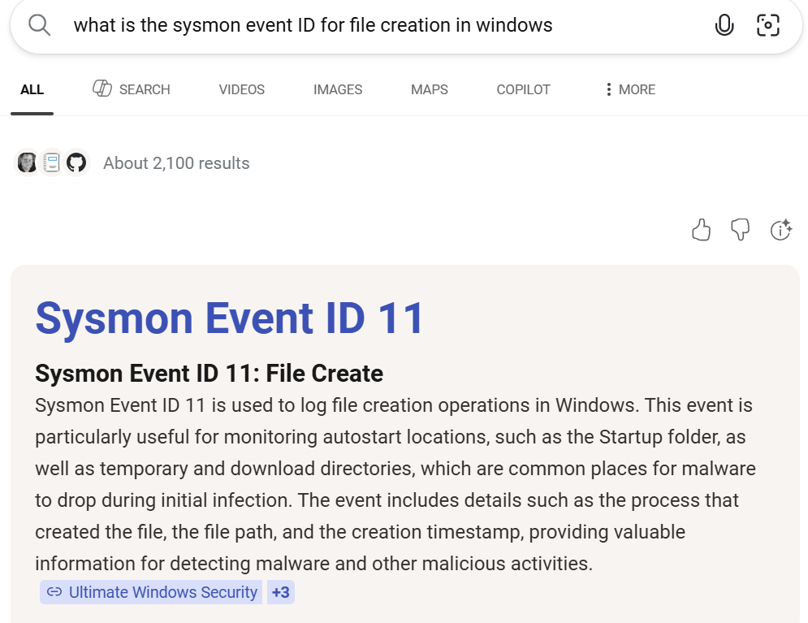

**Question:** What is the MD5 Hash of the ransomware
**Action:** `Scroll to the hashes section, use VirusTotal to confirm whether the hash is indeed a ransomware`
**Answer:** `290c7dfb01e50cea9e19da81a781af2c`
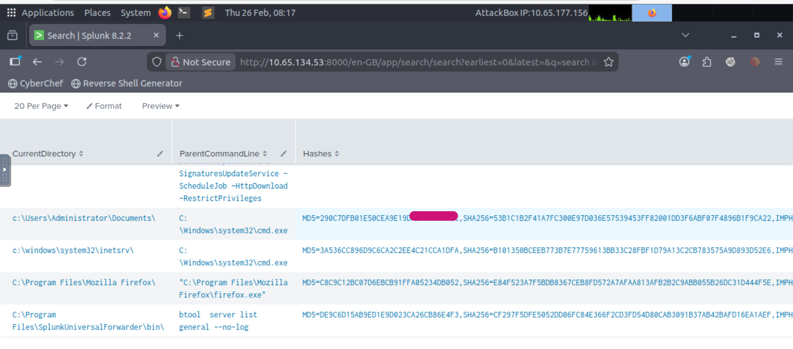

**Question:** What file was saved to multiple folder locations?
**Action:** Apply filter `index=* sourcetype="WinEventlog:Microsoft-Windows-Sysmon/Operational" EventCode 11 | table Image TargetFilename` -> check for files saved with `cmd.exe`

The Image is the process of the executable that is saving the file.
**Answer:** `readme.txt`

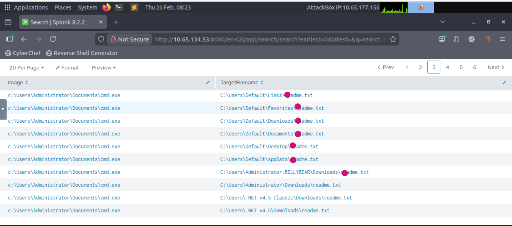

---

## Task 3: Persistence & Privilege Escalation
**Question:** What was the command the attacker used to add a new user to the compromised system?

**Action:** Apply filter `index=* sourcetype="WinEventLog:Security" EventCode 4720` -> `look for a malicious event`
*4720 is Windows Event ID for User Created*

*Apply:*`index=* sourcetype="WinEventlog:Microsoft-Windows-Sysmon/Operational" security ninja`

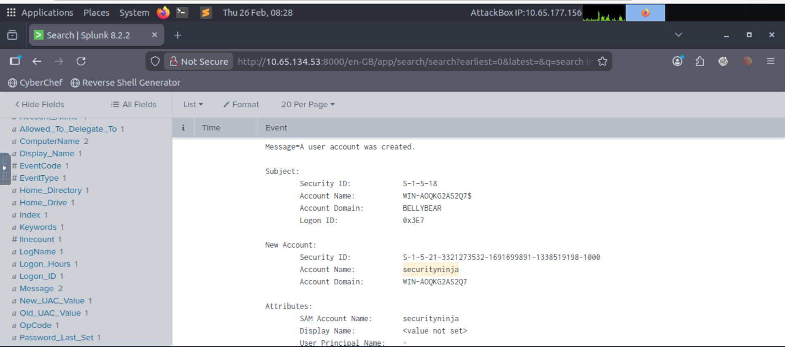

**Action:**  `index=* sourcetype="WinEventlog:Microsoft-Windows-Sysmon/Operational" security ninja`

**Result:** 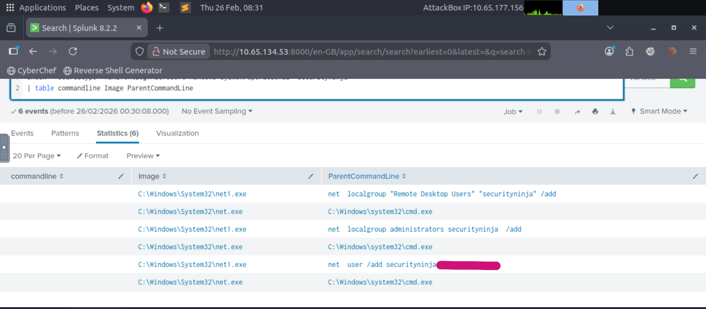

**Answer:** `net user /add securityninja hardToHack123$`

* *MITRE:* `TA0003-Backdoor`, `TA0004-privilege escalation` `T1136-Local account creation`
[Check summary](#mitre-mapping)

### Credential Access & Web Shells
**Question:** The attacker migrated the process for better persistence. What is the migrated process image (executable), and what is the original process image (executable) when the attacker got on the system?

This is a `Remote Thread Migration Process` which is used to `maintain persistence`
Process migration consists of *source process* and *target process*

**Action:** Apply filter  
`index=* sourcetype="WinEventlog:Microsoft-Windows-Sysmon/Operational" EventCode 8 | table SourceImage TargetImage`

**Answer:** `C:\Windows\System32\WindowsPowerShell\v1.0\powershell.exe,C:\Windows\System32\wbem\unsecapp.exe`

* *MITRE:* `T1055- Process Injection`
[Check summary](#mitre-mapping)
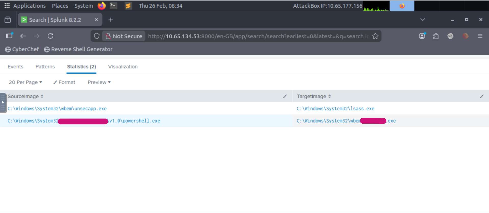

**Question:** The attacker also retrieved the system hashes. What is the process image used for getting the system hashes?

**Answer:** C:\Windows\System32\lsass.exe
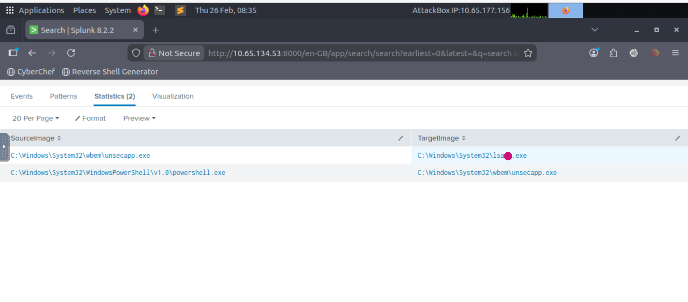

---

## Task 4: Web shell detection
**Question:** What is the web shell the exploit deployed to the system?

**Action:** Apply `index=* sourcetype="WinEventlog:Microsoft-Windows-Sysmon/Operational" *aspx`

**Answer:** i3gfPctK1c2x.aspx

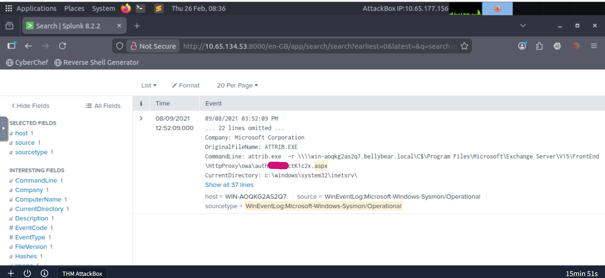

**Question** What is the command line that executed this web shell?

**Answer:** `attrib.exe  -r \\\\win-aoqkg2as2q7.bellybear.local\C$\Program Files\Microsoft\Exchange Server\V15\FrontEnd\HttpProxy\owa\auth\i3gfPctK1c2x.aspx``

**Question** What three CVEs did this exploit leverage? Provide the answer in ascending order.
**Answer:** `CVE-2018-13374,CVE-2018-13379,CVE-2020-0796`

---

## MITRE Mapping

| Tactic | Technique ID | Technique Name | Observation/Note |
| :--- | :--- | :--- | :--- |
| **Initial Access** | T1190 | Exploit Public-Facing Application | Used CVE-2018-13379 (FortiOS) |
| **Execution** | T1059.003 | Windows Command Shell | `cmd.exe` used for ransomware payload |
| **Persistence** | T1136 | Create Account | Created user `securityninja` |
| **Privilege Escalation** | T1078 | Valid Accounts | Added user to local admins group |
| **Defense Evasion** | T1055 | Process Injection | Sysmon Event ID 8: Process migration |
| **Credential Access** | T1003.001 | Credential Dumping: LSASS | Accessing `lsass.exe` for hashes |
| **Impact** | T1486 | Data Encrypted for Impact | Final stage of Conti payload |

## Key Take-aways
- Ransomware uses "noise" footprint. By using sysmon ID event ID 11, we see a single process creating several `readme.txt` files within a short time.

- CreateRemoteThread is a key indication of Process Injection. Monitoring migration into processes like `unsecapp.exe` is very important for identifying long-term persistence.
- The attacker was able to keep a low profile by using built in Windows tools.
`lsass.exe` for credential harvesting, `net user /add` for persistence.
