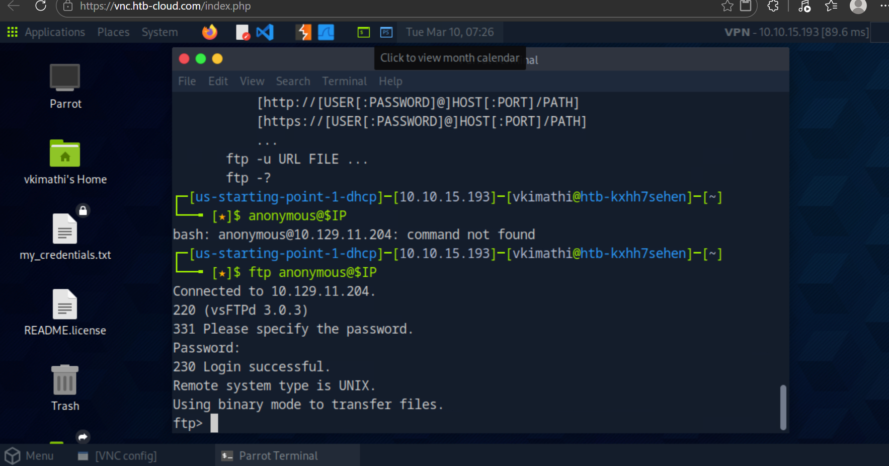
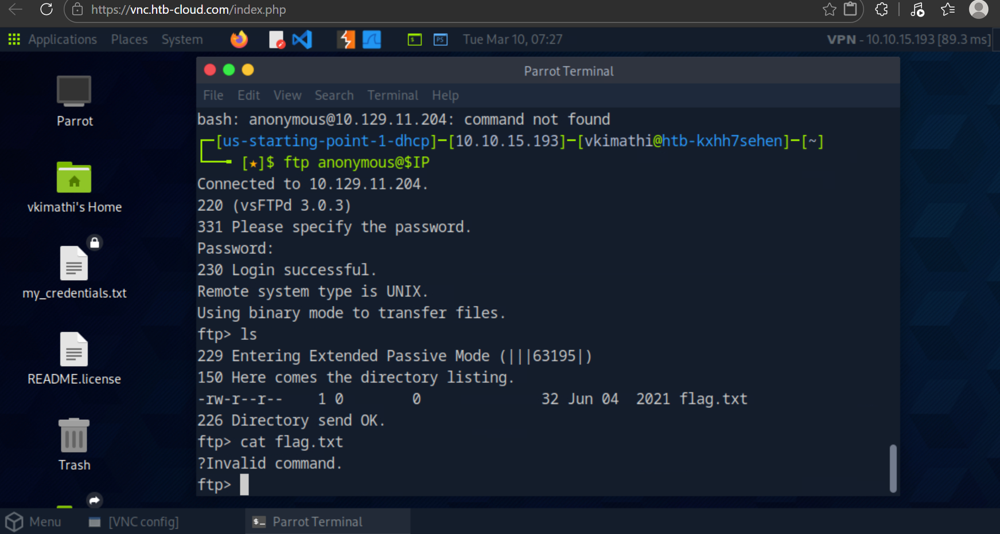
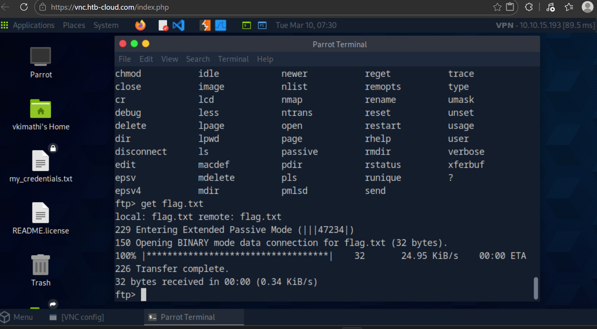
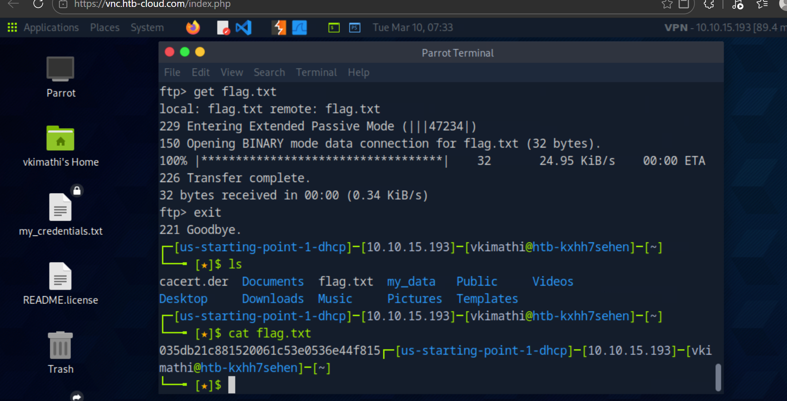

# Lab Report: Fawn Lab
## Difficulty: Easy

**Category:** Red Team
**Tools:** Nmap

**Platform:** HackTheBox

---


## Lab Overview and Objectives
The Fawn machine teaches enumeration and exploitation of an FTP (File Transfer Protocol) service.

 The **objective** include:
  - Identifying the FTP service
  - Exploitation of the FTP service
  - Retrieve the flag using anonymous login.


  ---

  # Tools Used

| Tool | Purpose |
|-----|------|
| Terminal | Command execution |
| Ping | Test connectivity |
| Nmap | Network scanning |
| anonymous | anonymous login |
  

# Lab Questions and Answers

### Task 1
**What does the 3 letter acronym FTP stand for?**

**Answer:**
`File Transfer Protocol`

---

### Task 2
**Which port does the FTP service usually listen on??**

**Answer:**
`21`

This is the default port for `FTP` connections.

---

### Task 3
**What acronym is used for the secure version of FTP??**

**Answer:**
`SFTP`

There are `2` secure versions:
**SFTP:** `File Transfer over SSH`
**FTPS:** `FTP over SSL/TLS`


---

### Task 4
**What tool is used to test connectivity with an ICMP echo request to test our connection to the target?**

**Answer:**
`ping`

---

### Task 5
**From your scans, what version of FTP is running?**

**Answer:**
`vsftpd 3.0.3`

This was discovered after running the service version enumeration.



---

### Task 6
**From your scans, what OS type is running??**


**Answer:**
`Unix`

---

### Task 7
**What command displays the FTP client help menu?**

**Answer:**
`ftp -?`

---


### Task 8
What username allows login without an account?
**Answer:** `anonymous`

Many FTP servers allow anonymous login, meaning users can connect without credentials.


---

### Task 9
What response code indicates "Login successful"?
**Answer:** `230`

---

### Task 10
Command used to list files on the FTP server?
**Answer:** `ls`

---

### Task 11
Command used to download a file from FTP?
**Answer:** `get`
```bash
get flag.txt
```

---

### Task 12
Root Flag
**Answer:** `035db21c881520061c53e0536e44f815`

---

# Nmap Scan

### Environment Setup
To streamline the investigation, the target IP was assigned to a local variable.

```bash
export IP="10.129.11.204"
echo $IP
```
---

## Enumeration
```bash
nmap -v -sV -sC $IP
```
* *MITRE:* `T1595` [Reference](#mitre-mapping)
### Nmap Scan Methodology

| Flag | Name | Function | Lab Application |
| :--- | :--- | :--- | :--- |
| `-v` | **Verbose** | Increases the output detail during the scan. | Used to see discovered hosts and open ports eg `port 21`. |
| `-sC` | **Default Scripts** | Runs the default set of Nmap Scripting Engine (NSE) scripts. | Used to check for common vulnerabilities (like anonymous login). | 
| `-sV` |**Service Enumeration** | Detects service version. | Shows the Version a service is running on eg `vsftpd 3.0.3` |

### Findings

**Port `21/tcp` is open **
It is running on service version `vsftpd 3.0.3`

---

## Exploitation

Since `Port 21` is an insecure service, we leverage `anonymous` command to exploit the vulnerabilities of this service. Simply `Click **Enter** to bypass password`

```bash
ftp anonymous@$IP
```
* *MITRE:* `T1078` [Reference](#mitre-mapping)

**Findings:**  

---

## Flag Discovery
* After a successful login, we use the **ls** command inside the ftp session to list all the files.
* The flag we are looking for appears as one of the files.
* We then use the **ftp ?** to look for file download command.
* Use **get flag.txt** to download flag into our local directory.
* Write **exit** to leave the ftp session.
* list files available using **ls** -> **cat flag.txt**

```bash
ls 
```
```bash
ftp ?
```
```bash
get flag.txt
```

```bash
exit
```
* *MITRE:* `T1039` [Reference](#mitre-mapping)
```bash
ls
```
```bash
cat flag.txt
```


---
## MITRE Mapping
|Technique                      | ID    | Description                                |
| ------------------------------ | ----- | ------------------------------------------ |
| Active Scanning                | T1595 | Using Nmap to discover services            |
| Anonymous FTP Login            | T1078 | Valid accounts used without authentication(`anonymous@IP`) |
| Data from Network Shared Drive | T1039 | Retrieving files from FTP(`Flag.txt`)                 |


---

## Lessons Learnt
* **FTP transmits credentials and files in plain text, making it vulnerable to interception.**
* **Allowing anonymous FTP access can expose sensitive files to attackers.**
* **Learn to directly interact with detected services.**


