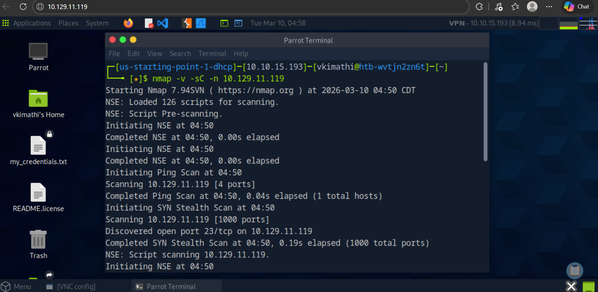
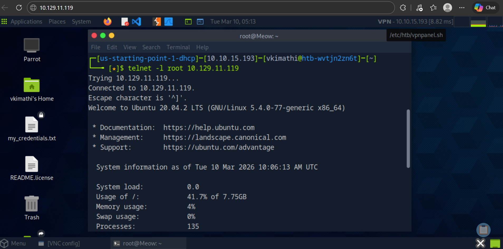
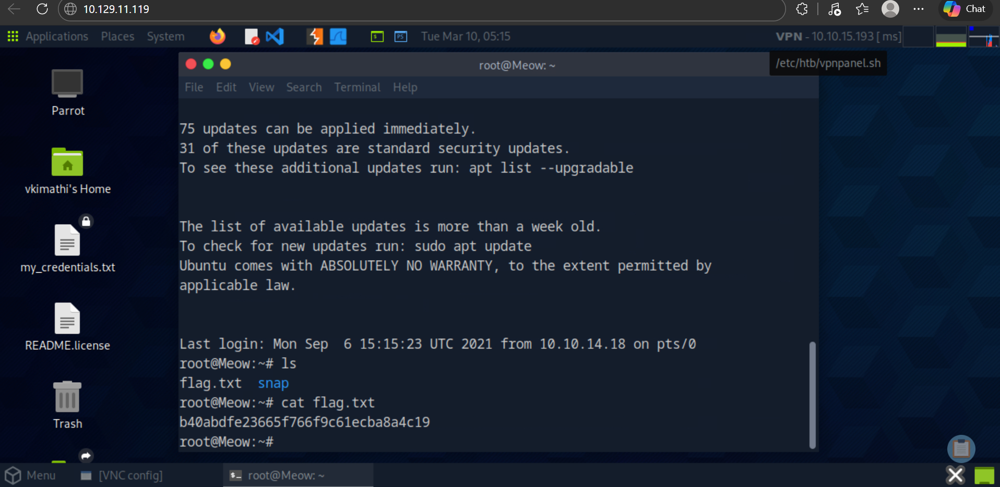

# Lab report: Meow
## Difficulty: Easy
**Category:** Red Team
**Tools:** Nmap

---


## Lab Overview and Objectives
The **Meow** machine is starting point Hack The Box lab designed to teach basic penetration testing workflow including:

- Connecting to the HTB Pawnbox
- Host discovery
- Port scanning
- Service enumeration
- Logging into a vulnerable service
- Retrieving the root flag


---

# Tools Used

| Tool | Purpose |
|-----|------|
| Terminal | Command execution |
| Ping | Test connectivity |
| Nmap | Network scanning |
| Telnet | Remote login |

---

# Lab Questions and Answers

### Task 1
**What does the acronym VM stand for?**

**Answer:**
`Virtual Machine`

---

### Task 2
**What tool do we use to interact with the operating system through commands?**

**Answer:**
`Terminal`

---

### Task 3
**What service do we use to form our VPN connection to HTB labs?**

**Answer:**
`Openvpn`

---

### Task 4
**What tool is used to test connectivity with an ICMP echo request?**

**Answer:**
`ping`

---

### Task 5
**What is the most common tool used to find open ports on a target?**

**Answer:**
`nmap`

---

### Task 6
**What service was discovered running on port 23/tcp?**

**Answer:**
`Telnet`

---

### Task 7
**What username can log into the target via Telnet with a blank password?**

**Answer:**
`Root`

---

# Nmap Scan

## Enumeration

```bash
nmap -v -sC -n 10.129.11.119
```

### Nmap Scan Methodology

| Flag | Name | Function | Lab Application |
| :--- | :--- | :--- | :--- |
| `-v` | **Verbose** | Increases the output detail during the scan. | Used to see discovered hosts and open ports. |
| `-sC` | **Default Scripts** | Runs the default set of Nmap Scripting Engine (NSE) scripts. | Used to check for common vulnerabilities (like remote login). |
| `-n` | **No DNS Resolution** | Disables reverse DNS lookups for all discovered IP addresses. | Speeds up the scan by avoiding unnecessary queries in a closed lab. |

**Findings**


This indicates that the machine allows `remote login using Telnet.`

---
## Exploitation

Since telnet is running, we use telnet manual page page to find an exploiting command. This is achieved by:

**Action:** *man telnet* -> */user* (to look for username command) -> *q* (to quit)

On the terminal, **Apply:** 
```bash
telnet -l root 10.129.11.119
```

We are using `root` as the username since we can log into a target over telnet with a blank password.



---

## Flag Discovery
After successful login `list files in the directory` by: *ls*

**Output:** `flag.txt` `snap`
Use *cat* to view the flag
```bash
ls
cat
```



---

## Lessons Learnt
* Telnet is very **insecure as it transmits credentials in plaintext**
* **Misconfigured services and default credentials** can lead to system compromise.
* Systems should **disable Telnet and use SSH instead**


